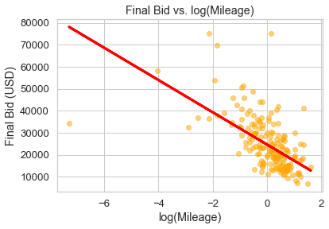

# Car Auction Final Bid Linear Regression

#### Manveer Sadhal
#### Sep 28, 2021

## Question
The goal of this project is to understand the relationship between a car's attributes, the attributes of the auction listing, and the car's final auction price on the website [BringATrailer.com](https://bringatrailer.com/). This analysis is specifically focused on the BMW M3 between model years 1994 and 2013 (chassis designations E36, E46, E90, E92, and E93).

The intent is to create a model that will help a bidder enter the lowest bid while still winning the auction.

## Data
1,121 completed auction pages were scraped to obtain the data for this analysis. Withdrawn auctions were skipped. Listings from outside of the USA were dropped from the data set. Additional cleaning was performed and entries removed where the car's color and transmission type could not be determined. After cleaning, 895 entries remain.

## Preliminary Modeling
Correlations between numeric features were evaluated. Data was split in to training, validation, and test groups. An ordinary least squares linear regression model was fit using the log of each car's mileage as the feature and the final bid as the target. When scored on the validation data set, this resulted in an R2 value of approximately 0.31.

## Further Analysis
Additional features will be added to the model, including the model year of the car, number of photos included in the listing, the date the auction was completed, and characteristics of each car (e.g. exterior color, transmission type, body style).

Feature engineering will be performed to add, remove, and transform features as needed. Different linear regression model types will be compared and the most appropriate model selected. The final model selection will be evaluated against the test data set.